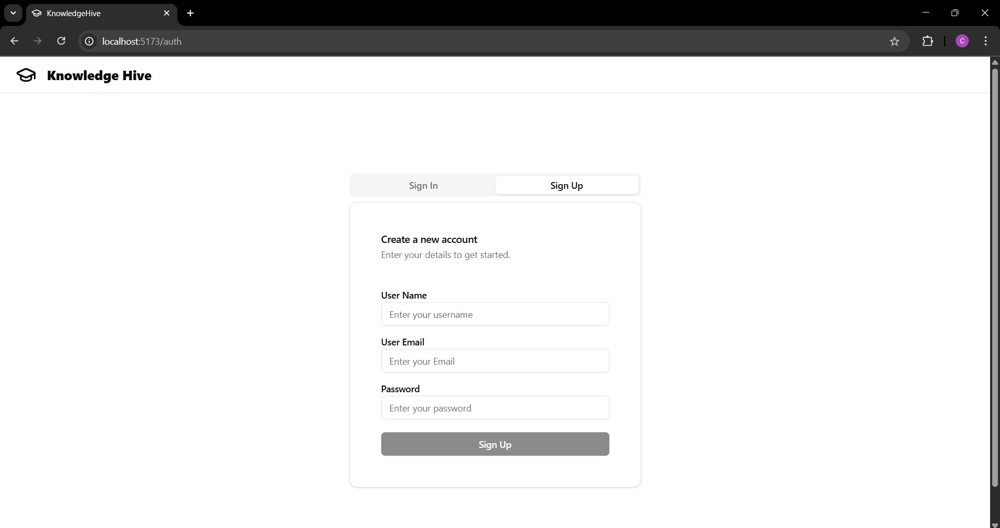
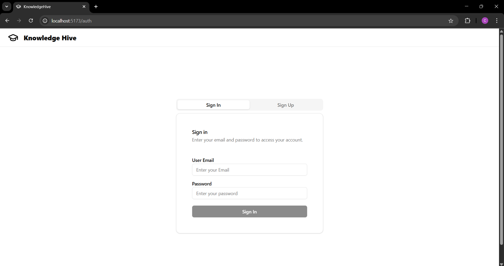
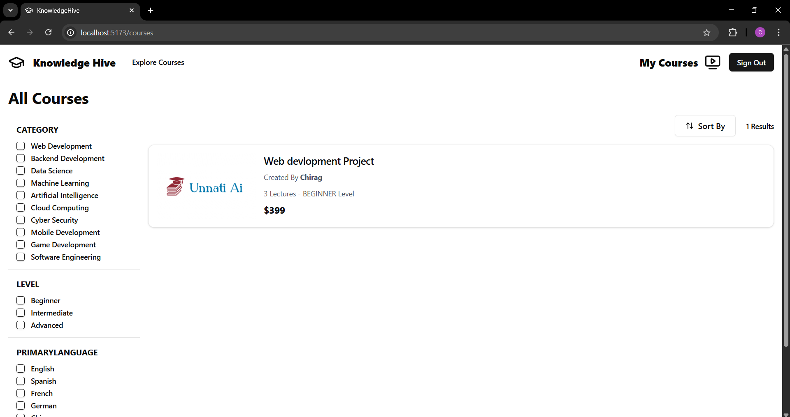
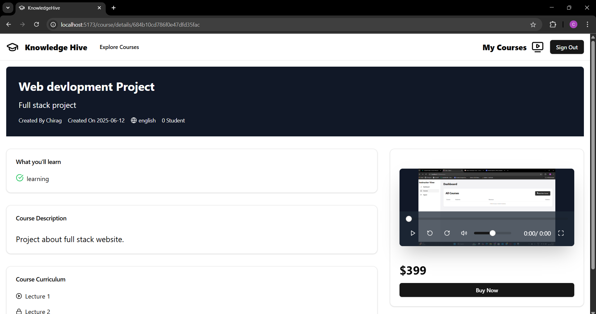
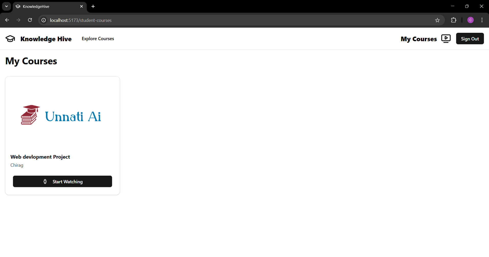
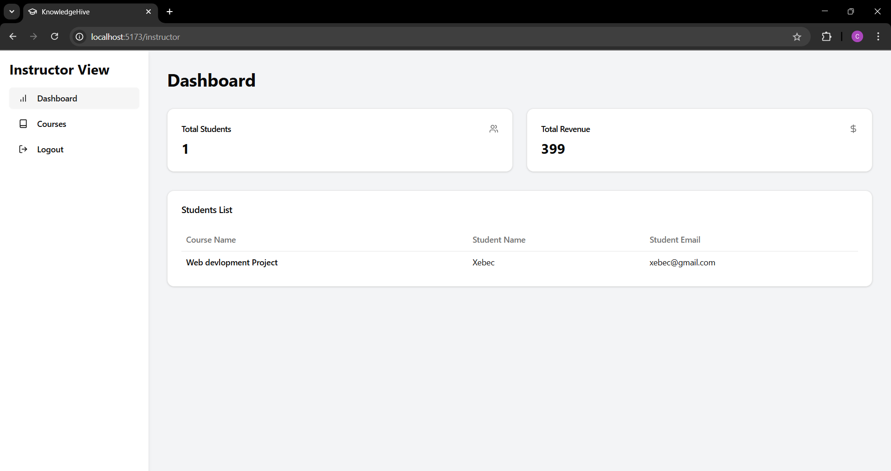
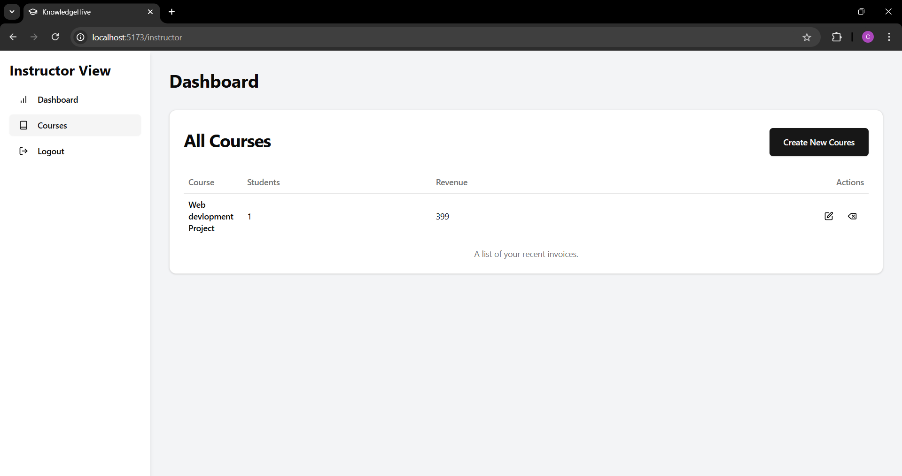
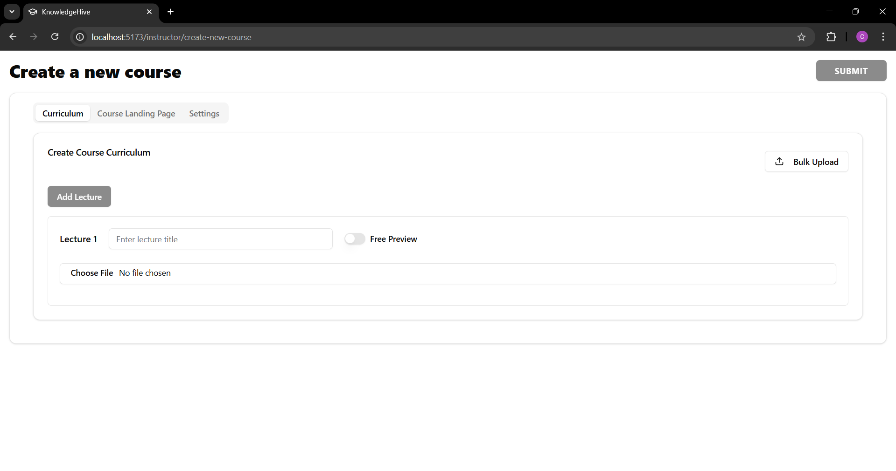
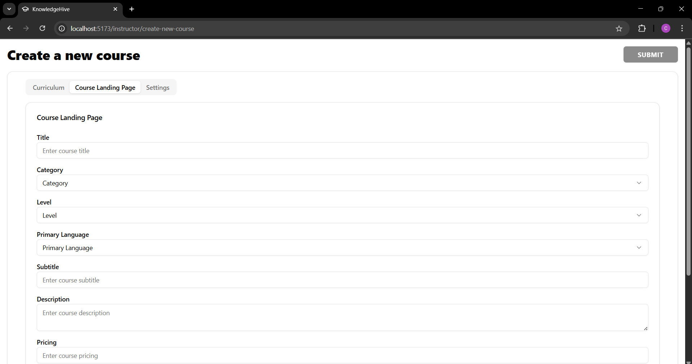
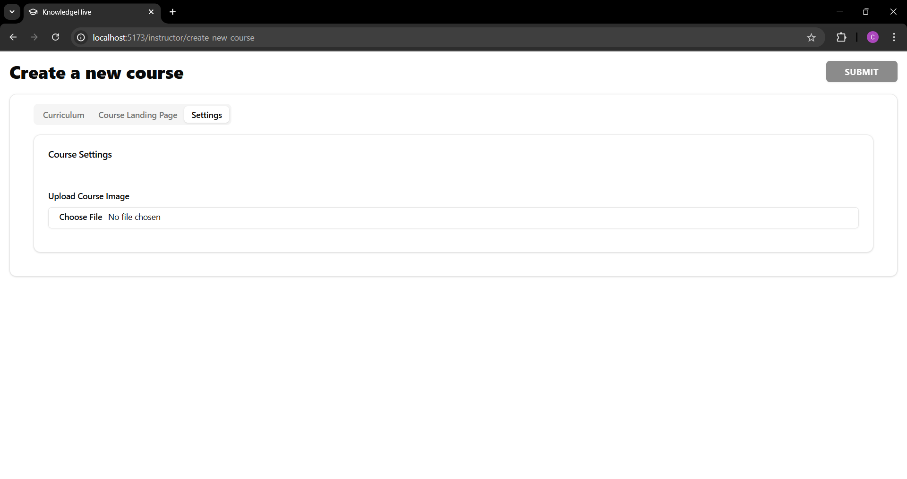

---


# 🧠 KnowledgeHive

## 📘 Your Gateway to Learning and Teaching

Welcome to **KnowledgeHive**, an innovative platform designed to empower learners and educators. It offers a dynamic space for individuals to access free and paid courses across various domains, while professionals can seamlessly share and monetize their expertise. Whether you're a student, professional, or a lifelong learner, KnowledgeHive makes education accessible and impactful.

---


## 👨‍💻 Project By: [@chiragcs8](https://github.com/Chiragcs8)

## 🚀 About Me
Hi, I'm **Chirag!** 👋  
I'm a passionate full stack developer, and this is complete project combining frontend and backend from scratch to solve real-world learning problems.

---

## ✨ Features

- 📚 **Diverse Course Catalog**: Access courses from tech to personal development.
- 💼 **Monetization for Educators**: Create, publish, and earn from your own courses.
- 🆓 **Free & Paid Courses**: Learn at your pace with flexible options.
- 🧭 **User-Friendly Interface**: Intuitive navigation for all users.
- 📊 **Progress Tracking**: Stay motivated by monitoring your learning journey.
- 🔐 **Authentication System**: Secure login and user roles (student/teacher/admin).

---

## 🛠️ Technologies Used

The project utilizes the following tools, frameworks, and libraries:

#### Frontend
 - React.js - JavaScript library for creating dynamic user interfaces.  
 - Tailwind CSS - Utility-first CSS framework for responsive styling.  
 - Axios - Simplifies HTTP requests and API integration.  

#### Backend
 - Node.js - JavaScript runtime for server-side programming.  
 - Express.js - Web framework for handling routes and APIs.  
 - Bcryptjs - Encrypts and secures user passwords.  
 - Cloudinary - Cloud-based service for managing media files.  
 - Cors - Middleware to handle cross-origin resource sharing.  
 - Mongoose - ODM library for MongoDB, simplifying database interactions.  
 - Multer - Middleware for handling file uploads in forms.  
 - paypal-rest-sdk - Library for integrating PayPal payment gateway.  

#### Development Tools
 - Nodemon - Automatically restarts the server during development.  

#### Database
 - MongoDB - NoSQL database for storing application data.  

#### Authentication
 - JWT (JSON Web Tokens) - Secures user authentication and session management.

---

## Usage Instructions

- For Learners:

  1. Sign up or log in to your account.
  2. Browse through the course catalog and enroll in a course.
  3. Track your progress and complete the course at your own pace.

- For Educators:

  1. Create an account and set up your instructor profile.
  2. Upload your course content, set pricing (if applicable) and publish it.
  3. Manage your course and track your earnings.


---
## ⚙️ Setup Instructions

1. **Clone the repository:**
   ```bash
   git clone https://github.com/Chiragcs8/KnowledgeHive.git
   cd KnowledgeHive
   ```

2. **Navigate to frontend and install dependencies:**

   ```bash
   cd Frontend
   npm install
   ```

3. **Navigate to backend and install dependencies:**

   ```bash
   cd ../Backend
   npm install
   ```

4. **Setup environment variables:**
   Create a `.env` file inside `Backend/` with:

   ```
   MONGO_URI=your_mongodb_connection_string
   JWT_SECRET=your_secret_key
   PORT=5000
   ```

5. **Run the application:**

   In one terminal (for backend):

   ```bash
   cd Backend
   npm start
   ```

   In another terminal (for frontend):

   ```bash
   cd Frontend
   npm start
   ```

6. Open your browser and visit:

   ```
   http://localhost:3000
   ```

---

## 📸 Screenshots

---

  ###   SignUp



  ###   SignIn



---

  ###   StudentView

  -  Home Page

  

  - CoursePage

  

  - CourseDetailsPage

  

   - StudentCoursePage

  

  ---

  ###   InstructorView

  -  InstructorDashboardPage

  
  
  -  InstructorCoursesPage

  

  -  Curriculum

  

  -  CourseLandingPage

  

  -  InstructorSettingsPage

  

---

## 💬 Feedback

If you have ideas, issues, or feedback, feel free to [open an issue](https://github.com/Chiragcs8/KnowledgeHive/issues) or connect with me on GitHub!


